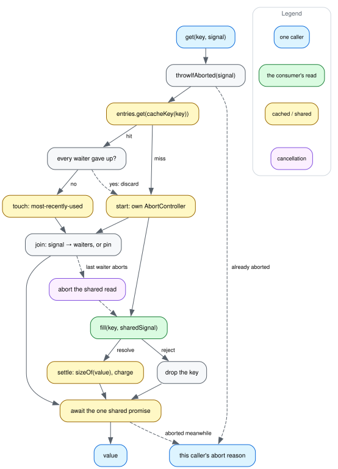

# How a `get()` flows

[dataflow.dot](img/dataflow.dot) is the source; see
[CONTRIBUTING.md](../CONTRIBUTING.md) for how to re-render it.

A `get()` maps the key through `cacheKey`, and either joins the entry already
under that key or starts one. Either way the caller ends up awaiting **one**
promise per key — the read runs under an `AbortController` the entry owns, not
under any caller's signal, and the caller's own signal is checked on the way in
and again when the read settles. That separation is the whole package: a caller
that gives up is told it gave up, and everyone else keeps the read.

Only two things about a key are per-caller: whether _this_ caller aborted, and
whether its abort was the last one. Everything else — the promise, the value,
its weight against the budget, its position in LRU order — belongs to the entry.

## Why the caller's signal is checked twice

The first check is before the cache lookup. A caller can arrive with a signal
that has already fired, because the abort landed while some earlier `await` was
in flight and nothing in between looked at it. Such a caller must not start a
read it has no interest in, and — the bug that shipped in
`@gmod/abortable-promise-cache` — must not be registered as a waiter on someone
else's, since an `abort` listener never fires on a signal that aborted before
the listener was added. The waiter count could then never reach zero, so the
read turned uncancellable for everyone joined to it.

The second check is after the shared promise settles, on both the resolve and
the reject path. It reports this caller's own cancellation in preference to
whatever the shared read said: if we asked to stop, that is the answer we want,
and when the read itself was cancelled it is because we and everyone else asked
it to.

## What `join` does with a signal

`join` is where a caller's interest is registered, and it has four cases:

- **a real, unaborted signal** — added to the entry's waiter set with an `abort`
  listener. The listener is registered with
  `{ once: true, signal: entry.dispose.signal }`, so it comes off whether the
  abort fires or the entry settles. Without that second half, a long-lived
  signal accumulates one listener per key it ever touches.
- **no signal** — the entry is _pinned_. A caller that never asked to be
  cancellable cannot give up, so no set of aborts should stop the read it
  joined. One signal-free consumer therefore makes that read uncancellable for
  everyone joined to it.
- **a duck-typed signal with no `addEventListener`** — pinned too, for the same
  reason: nothing here can learn when such a caller gave up. It is still told
  about its own cancellation when the read settles; what it loses is only the
  ability to stop the read early, which an unsubscribable signal cannot ask for
  anyway. Consumers really do hand-roll `{ aborted: false }` — `@gmod/bam`'s
  `test/csi.test.ts` is one — and subscribing to it used to be a `TypeError`
  instead of a read.
- **an already-aborted signal** — not a waiter (see above). Unreachable today,
  because `get()` rejects such a caller before `join` sees it, with no `await`
  in between.

Only the last waiter's abort reaches the read: the listener removes its signal
from the set, and aborts the entry's controller only if the set is now empty and
nothing pinned it.

## The doomed-entry branch

A read every caller has abandoned has aborted its controller but has not
necessarily rejected yet, so for a moment the map still holds it. Joining one
means inheriting a cancellation that has nothing to do with you, so both `get()`
and `getIfCached()` treat it as a miss: `get()` drops it and starts a fresh
read, `getIfCached()` drops it and answers `undefined`.

## What settling does

A resolved read is weighed with `sizeOf`, and that weight is added to the
cache's total and charged to the [shared budget](memory.md) if there is one. The
entry's idle clock starts here rather than at `start()` — the clock is about the
value existing, so a read slower than `idleTimeoutMs` would otherwise arrive
already expired and be swept before the query that paid for it got a single hit.
Settling also drops the entry's abort listeners and clears its waiter set, which
is why `get()` does not `join` an entry that has already settled: nothing would
ever take the caller back out.

A **rejected** read caches nothing. The key is dropped before the entry is
marked settled, so the next caller starts over rather than inheriting the
failure, and one transient error does not poison the key for the life of the
cache.

Then, and only then, eviction runs — which is [memory.md](memory.md).

## What the diagram leaves out

`getIfCached()`, which is the same lookup without the read, without waiter
registration and without the per-caller abort translation; `has()`, which is the
only lookup that does _not_ mark an entry most-recently-used; and the `fill`
passed per `get()` call rather than on the constructor, which changes where the
read comes from and nothing else about the path.
