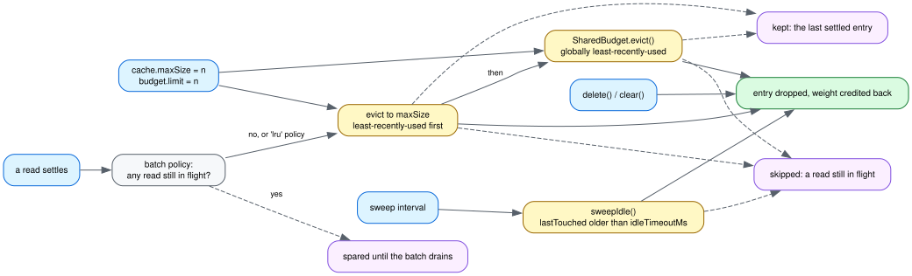

# Bounding what the cache retains

[eviction.dot](img/eviction.dot) is the source; see
[CONTRIBUTING.md](../CONTRIBUTING.md) for how to re-render it.

Four things drop an entry, and they answer different questions. `maxSize` is a
ceiling checked when a read settles. `idleTimeoutMs` is the only reclamation
that happens while nothing is calling in. A `SharedBudget` bounds several caches
in aggregate, which no per-cache ceiling can do. And `delete()`/`clear()` are
the consumer saying so directly.

Two entries are never dropped by any of the automatic three: a read still in
flight, which has no weight to reclaim and whose de-duplication its waiters are
relying on, and the last settled entry, which the caller needs for the request
in flight. So the worst any budget can cost is a re-read — nothing is ever
refused for being too large.

## `sizeOf` is the point

The package exists because four gmod packages each hand-rolled this cache,
identical except for how they weighed an entry: `@gmod/bam` and `@gmod/tabix`
weigh decompressed bytes, `@gmod/bbi` weighs entries, `@gmod/cram` weighs
decoded records — a decoded record has no cheap size. Nothing can weigh a value
until its read settles, so a cache that budgets this way has to own its entries,
which is exactly why a plain-LRU-backed package could not serve them.

Omit `sizeOf` and the budget counts entries.

## `maxSize` wants to be generous

Set below one request's working set, a budget does not cache less — it caches
_nothing_. Each value falls out before the next request can reuse it, while the
reads in flight retain their memory anyway. That cliff is the reason the
per-cache default is `Infinity`: what a sensible limit is depends entirely on
what is being cached, so the package does not guess.

Unbounded is the permissive default, not the safe one. With no budget the cache
grows for the life of the object; `@gmod/tabix` measured 2 GB RSS panning a
dense VCF before it bounded this
([tabix-js/docs/caching.md](https://github.com/GMOD/tabix-js/blob/main/docs/caching.md#chunkcachesize-never-refuses-a-read),
which also has what a pinned budget twenty times under the default cost: 47
refills out of 47 against 0).

`cache.maxSize = n` is an accessor, not a field, so lowering it evicts
immediately. As a plain field it did nothing until the next read happened to run
the eviction loop, which on an idle consumer is never — and shedding memory
under pressure is the whole reason a consumer lowers it.

## `idleTimeoutMs` makes a generous ceiling affordable

`maxSize` is checked when a read settles, so an idle cache sits at whatever
level it reached and never gives it back. For an object that lives as long as
its UI — a genome browser parked on a region, times every open track — that
resting level is the memory that matters, and no ceiling alone will lower it.
`idleTimeoutMs` turns the ceiling into a peak rather than a resting level.

The clock runs from the last **read** of an entry, or from its fill settling if
nothing has read it since. So something fetched once and used every second never
expires, and a slow read still gets its full timeout to be reused in rather than
spending it on its own download. The sweep skips reads in flight.

The interval is a quarter of the timeout, bounding the lag between an entry
going idle and being reclaimed at about 1.25x rather than 2x. `sweepIdle()`
reclaims on demand — on a tab going hidden, say — instead of waiting for it.
`@gmod/bam` measured a pan that held 331 MB going to 0 MB once idle
([ADR 0015](https://github.com/GMOD/bam-js/blob/main/agent-docs/adr/0015-reclaim-the-chunk-cache-when-nothing-is-using-it.md)).

**There is no `dispose()` to forget to call.** The timer is armed by the first
read to _settle_ and stopped by the first sweep that finds no settled entry
left, so it runs only while it has something to reclaim, and it `unref`s itself
where that exists. A consumer that drops the cache without clearing it leaves
one timer alive for at most a timeout plus an interval. Note the stop condition
is "nothing settled left", not "the map is empty": a read that never settles — a
stalled fetch on a dead connection, which is exactly when a consumer gives up —
is never swept, and against an empty-map condition that one hung read pinned the
timer, the cache, and everything its fill closed over, forever.

## `evictionPolicy: 'batch'` — try a bigger `maxSize` first

`'batch'` waits until no reads are in flight and then spares everything that
batch touched. The case for it: one request starts many reads and holds all
their values until it returns, so evicting one mid-request frees nothing and
only guarantees the next identical request re-reads it.

`@gmod/cram` adopted it on a 117ms-against-12ms measurement and then dropped it
again, and the sequence is the useful part. That measurement was taken with a
budget 2.75x _below_ the request's working set; raising the budget above the
working set made the two policies measurably identical — same re-read counts,
times inside noise — because a request that fits has nothing to evict mid-flight
under either. `@gmod/bam` measured it from the other side: on a pan workload
over an undersized budget, `'batch'` did not rescue it at all, matching `'lru'`
re-read for re-read while retaining 1.7x the memory.

So `'batch'` changes anything only when a batch exceeds the budget, and what it
does there is exceed the budget — cram measured it holding 420,000 records
against a stated limit of 20,000. That is the mechanism, not a side effect: a
consumer lowering the budget to constrain memory will not get what it asked for.
Reach for it when a too-small budget is genuinely forced on you and the workload
is repeated identical requests. No consumer currently does: both sides are
written up where they were measured, in
[cram-js ADR 0005](https://github.com/GMOD/cram-js/blob/main/docs/adr/0005-drop-the-batch-eviction-policy.md)
and
[bam-js ADR 0013](https://github.com/GMOD/bam-js/blob/main/agent-docs/adr/0013-the-batch-eviction-policy-does-not-transfer.md).

Ending a batch bumps a counter that the survivors' marks are compared against,
which ages all of them out at once; clearing a mark per entry would be
O(entries) on every batch, including the batches under budget that reach there
only to do that.

## `SharedBudget` — when the cache count is a property of the workload

A per-cache ceiling does not bound a consumer that scales the number of caches.
`@gmod/bam`'s 1 GB default is sized so a single track's pan never thrashes;
jbrowse holds one `BamFile` per open track, and three moderately deep alignment
tracks browsing eight windows measured 1109 MB retained and 1665 MB RSS with
**no cache anywhere near its own ceiling** — so not one byte of that was the
budget's doing.

Dividing the ceiling by the file count walks straight into the cliff above. On
that same three-track workload, 1 GB split as 342 MB each cost 16 refills on the
revisit; split eight ways as 128 MB each it cost 101, against 98 for the cold
pass — worse than no cache at all. A shared budget does not have that failure,
because a member yields only what is _globally_ least-recently-used: tracks the
reader is not looking at age out and hand their space to the one being panned,
so the active track keeps a working set whatever the track count. The workload,
the split, and the refill counts are
[bam-js ADR 0018](https://github.com/GMOD/bam-js/blob/main/agent-docs/adr/0018-a-per-file-ceiling-is-not-a-bound-on-a-consumer-with-many-files.md),
which is why this class exists.

Two things to know before reaching for one:

- **Every member must weigh in the same unit.** `total` is a sum over members,
  so it means nothing unless their `sizeOf` agree — and across these packages
  they do not. A budget holding a bam cache (bytes) and a cram cache (records)
  would be adding bytes to records and bounding neither. `sizeOf` is opaque by
  design, so nothing can check this: group members by unit, one budget per
  group.
- **A budget composes with `maxSize` rather than replacing it.** A cache that
  passes only a budget is unbounded on its own and bounded in aggregate, which
  is usually what you want, since the point of sharing is to let one busy member
  use most of the total. Each cache gets under its own ceiling first and only
  then competes for the shared one.

Members are held weakly. The consumer this is for keeps one budget per worker
and one cache per open track, and closing a track reclaims by dropping the last
reference to the adapter — a budget holding its members strongly would silently
convert that into a leak, which is the exact bug it exists to prevent. The
budget keeps a `WeakRef` and the member's last known weight beside it, so a
collected member is pruned and its weight credited back on the next pass, and
there is no `unregister` to forget.

## Why entries carry a sequence number as well as a timestamp

`lastTouched` is wall-clock, which is what the idle sweep needs. It cannot order
evictions: `Date.now()` has millisecond resolution, so a burst of cache hits
inside one millisecond all carry the same stamp and a tie resolves to whichever
member the budget happened to scan last. `seq` is a counter ticked on every
touch, giving a total order across _different_ caches, which is what a shared
budget compares. The two answer different questions — "how long since" and
"which came first" — so both are kept.

For the same reason, a read settling stamps `lastTouched` but deliberately does
not `touch()` the entry. A read's latency is a property of the transport, not of
how the consumer is using the cache, so ordering evictions by it preferentially
keeps whatever was slowest to arrive — in `@gmod/tabix` that is the largest
chunk in the query, which is the last thing a budget should retain.

## What none of this bounds

Retained weight, not the heap. Reads in flight are never evicted, a query holds
everything it parsed until it returns whether or not the cache still does, and a
value weighed once at settle can grow afterwards — `@gmod/bam` memoizes `end`,
`CIGAR` and `tags` onto a record the first time a renderer touches them, and
measured +38% over the weighed size. Size these against what you want to _keep_,
and bound total memory somewhere that can see the whole process.

Both consumer caching docs have a section on this, with their own numbers:
[bam-js](https://github.com/GMOD/bam-js/blob/main/docs/caching.md#none-of-them-bound-peak-memory)
and
[tabix-js](https://github.com/GMOD/tabix-js/blob/main/docs/caching.md#none-of-these-bound-peak-memory).
[consumers.md](consumers.md) maps the rest of the measurements to where they
were taken.
